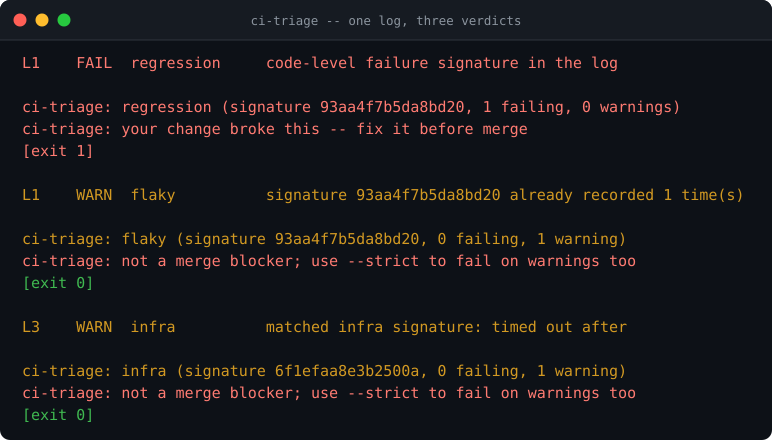
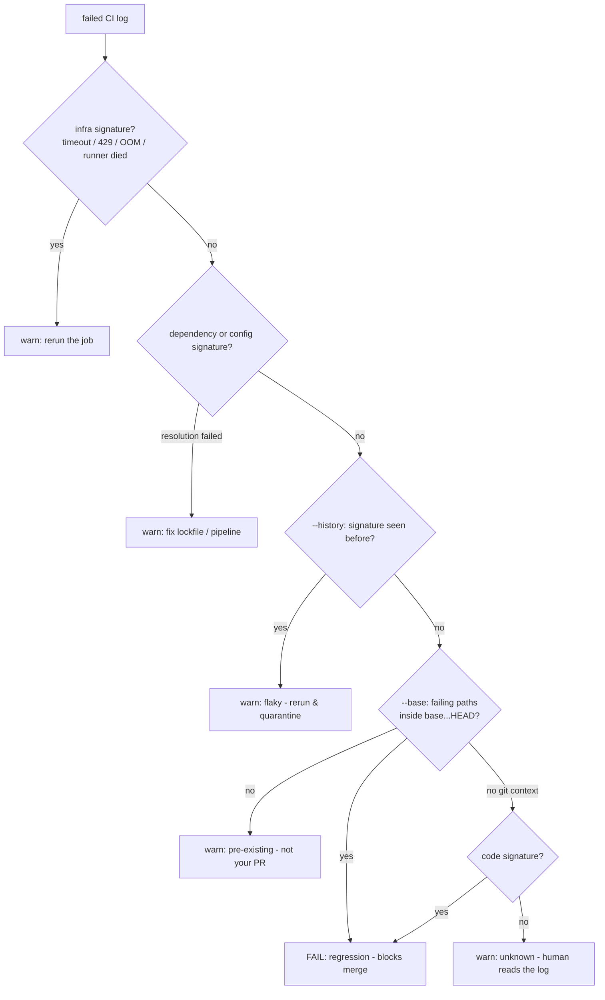

# ci-triage

**CI is red: flaky test, infra blip, or a real regression that should block the merge?** `ci-triage` answers from the log alone - plus your local git history - in milliseconds, offline. No model reads your build output, no API key, no telemetry: **exit 1 means exactly one thing, a regression your diff caused.** Everything else exits 0 and tells you where to route it.

[](https://github.com/F0Rextasy/ci-triage/actions/workflows/test.yml)
[](https://www.python.org/)
[](#what-it-will-never-do)
[](https://skills.sh/F0Rextasy/ci-triage)
[](LICENSE)



## Why this exists

Every CI triage tool shipped in 2026 sends the log to an LLM (Anthropic API few-shot, "AI root cause", hosted services): minutes per verdict, dollars per month, and your source paths in someone's prompt. But the first three answers were never a judgment call - a `429` is infra, a pip resolution error is dependency, `command not found` is config. Those are **regex over the log**. The two hard questions have cheap deterministic answers too: *seen this exact failure before?* (local signature history) and *does the failing code even sit in my diff?* (git).

The demo above is the same log, three runs: first sighting blocks as a regression, the repeat becomes a flake, an infra log reruns without blocking anyone.

## Quick start

```bash
# install the skill into any agent (Claude Code, Codex, Cursor, OpenCode, ...):
npx skills add F0Rextasy/ci-triage

# or run it directly:
git clone https://github.com/F0Rextasy/ci-triage
cd ci-triage
python scripts/ci-triage failed-job.log --history .ci/triage.json --base origin/main
```

| Exit | Meaning |
| --- | --- |
| `0` | not a merge blocker: flaky / pre-existing / infra / dependency / config / unknown |
| `1` | `regression` - your diff broke it (or any warning with `--strict`) |
| `2` | usage error |

Pipe logs in (`-` or no argument on a pipe), `--format json` for machines, `--strict` to block on warnings too.

## How it decides

First match wins; later inputs are never consulted once an earlier one answers:



Environment beats history beats git beats "it looks like code": your code is not guilty of a `429`, and nothing gets called `regression` without either a code signature or a failing path inside the diff.

## The seven classes

| Class | Severity | Decided by | Action |
| --- | --- | --- | --- |
| `regression` | **fail** | code marker in log + failing path inside your diff | fix before merge |
| `pre-existing` | warn | `git diff --base...HEAD` never touches the failing paths | not your PR |
| `flaky` | warn | normalized signature already in `--history` | rerun, quarantine |
| `infra` | warn | timeout / 429 / 503 / OOM / runner died | rerun |
| `dependency` | warn | pip/npm/cargo resolution failure | fix lockfile |
| `config` | warn | command not found / permission / missing secret | fix pipeline |
| `unknown` | warn | no pattern matched | human reads the log |

**Signature** = SHA-256 of the failure excerpt with churn stripped (durations, SHAs, URLs, paths), so the same test failing twice hashes the same. The history file is plain local JSON - the only state, and it never leaves your machine. Full catalogue: [references/RULES.md](references/RULES.md).

## Evidence (real outputs)

```console
$ python scripts/ci-triage examples/regression.log --history hist.json --no-color
L1    FAIL  regression     code-level failure signature in the log

ci-triage: regression (signature 93aa4f7b5da8bd20, 1 failing, 0 warnings)
ci-triage: your change broke this -- fix it before merge
[exit 1]

$ python scripts/ci-triage examples/regression.log --history hist.json --no-color
L1    WARN  flaky          signature 93aa4f7b5da8bd20 already recorded 1 time(s)

ci-triage: flaky (signature 93aa4f7b5da8bd20, 0 failing, 1 warning)
ci-triage: not a merge blocker; use --strict to fail on warnings too
[exit 0]
```

Contract tests, 8 for 8 - one of them builds a real git repo to prove the `pre-existing` rule:

```console
$ python -m unittest discover -s tests -v
........
----------------------------------------------------------------------
Ran 8 tests in 1.156s

OK
[exit 0]
```

## Wire it into CI

```yaml
- if: failure()
  run: |
    gh run view ${{ github.run_id }} --log-failed > job.log
    python scripts/ci-triage job.log --history .ci/triage.json --base origin/main
```

Commit `.ci/triage.json` (or keep it as a cache artifact): the history is what turns repeat offenders from "merge blocked" into "flaky, rerun".

## What it will never do

- Send your CI log to a model - that is this repo's whole reason to exist.
- Call an `infra` signature a `regression` to sound decisive.
- Mark something `flaky` without the history entry that proves it repeated.

## The family

Deterministic gates - one Python script each, stdlib, same exit contract:

| Gate | Catches |
| --- | --- |
| [preflight](https://github.com/F0Rextasy/preflight) | committed `.env`, weak secrets, debug-in-prod, wildcard CORS |
| [bandaid](https://github.com/F0Rextasy/bandaid) | symptom-suppression patches: swallowed errors, disabled tests, removed guards |
| [prove-it](https://github.com/F0Rextasy/prove-it) | claims with no executed evidence behind them |
| [testgate](https://github.com/F0Rextasy/testgate) | tests that can never fail |
| [shipcheck](https://github.com/F0Rextasy/shipcheck) | broken, unimportable, or stale release artifacts |
| [dsh-gate](https://github.com/F0Rextasy/dsh-gate) | red turns closing green in DeepSeek Harness |
| **ci-triage** (this repo) | red CI triaged without an LLM |
| [docproof](https://github.com/F0Rextasy/docproof) | documentation snippets that no longer parse or run |

## License

[MIT](LICENSE)
